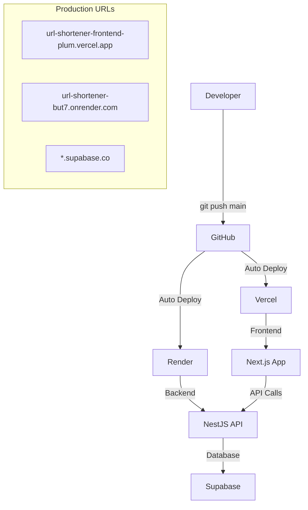

# Production Deployment Guide

Complete guide for deploying the URL Shortener Platform to production using the current Supabase +
Render + Vercel architecture.

---

## 🏗️ Architecture Overview



### Current Production Setup

| Component    | Service  | URL                                                                                       | Features                   |
| ------------ | -------- | ----------------------------------------------------------------------------------------- | -------------------------- |
| **Frontend** | Vercel   | [url-shortener-frontend-plum.vercel.app](https://url-shortener-frontend-plum.vercel.app/) | Auto-deploy, Edge, HTTPS   |
| **Backend**  | Render   | [url-shortener-but7.onrender.com](https://url-shortener-but7.onrender.com)                | Auto-deploy, Health checks |
| **Database** | Supabase | `*.supabase.co`                                                                           | Managed PostgreSQL         |

---

## 🚀 Quick Deployment (Already Configured)

The platform is **already deployed and running**! This guide helps you:

- Deploy your own instance
- Update existing deployments
- Configure new environments

---

## 📋 Prerequisites

### Required Accounts

1. **GitHub Account** - For code repository
2. **Vercel Account** - For frontend deployment (free tier available)
3. **Render Account** - For backend deployment (free tier available)
4. **Supabase Account** - For managed database (free tier available)

### Required Tools

- Git configured with your GitHub account
- Node.js 20+ and pnpm 9.0.0+
- Supabase CLI (for database setup)

---

## 🗄️ Database Setup (Supabase)

### Step 1: Create Supabase Project

1. **Go to [Supabase Dashboard](https://supabase.com/dashboard)**
2. **Click "New Project"**
3. **Fill in project details**:
   - Organization: Your organization
   - Name: `url-shortener-prod`
   - Database Password: Generate strong password
   - Region: Choose closest to your users
4. **Wait for project creation** (2-3 minutes)

### Step 2: Configure Database

```bash
# Clone your repository locally
git clone https://github.com/kashaf12/url-shortener.git
cd url-shortener

# Install Supabase CLI if not already installed
npm install -g supabase

# Login to Supabase
supabase login

# Link to your project
supabase link --project-ref your-project-ref
```

### Step 3: Set up Database Schema

```bash
# Generate migration for existing schema
supabase db diff --use-migra -f initial_schema

# Push schema to production
supabase db push
```

### Step 4: Get Production Credentials

1. **Go to Project Settings → API**
2. **Copy these values**:
   - Project URL
   - Anon (public) key
   - Service role (secret) key
3. **Go to Project Settings → Database**
4. **Copy connection string**

---

## 🖥️ Backend Deployment (Render)

### Step 1: Create Render Account

1. **Go to [Render Dashboard](https://render.com)**
2. **Sign up/Login with GitHub**
3. **Connect your GitHub repository**

### Step 2: Create Web Service

1. **Click "New +" → "Web Service"**
2. **Connect GitHub repository**: `kashaf12/url-shortener`
3. **Configure service**:
   ```yaml
   Name: url-shortener-backend
   Environment: Node
   Region: Choose your region
   Branch: main
   Build Command: cd apps/backend && pnpm install && pnpm build
   Start Command: cd apps/backend && pnpm start:prod
   ```

### Step 3: Configure Environment Variables

Add these in Render dashboard → Environment:

```env
# Application Settings
PORT=8000
NODE_ENV=production
BASE_URL=https://your-app-name.onrender.com
LOG_LEVEL=info
SERVICE_NAME=url-shortener-api

# Supabase Production Database
DATABASE_HOST=db.your-project-ref.supabase.co
DATABASE_PORT=5432
DATABASE_NAME=postgres
DATABASE_USERNAME=postgres
DATABASE_PASSWORD=your-supabase-db-password

# Supabase URLs and Keys
SUPABASE_URL=https://your-project-ref.supabase.co
SUPABASE_ANON_KEY=your-anon-key
SUPABASE_SERVICE_ROLE_KEY=your-service-role-key
```

### Step 4: Deploy

1. **Click "Create Web Service"**
2. **Wait for deployment** (5-10 minutes)
3. **Verify deployment**:
   ```bash
   curl https://your-app-name.onrender.com/health
   ```

### Step 5: Configure Health Checks

Render automatically monitors the `/health` endpoint. No additional configuration needed.

---

## 🎨 Frontend Deployment (Vercel)

### Step 1: Create Vercel Account

1. **Go to [Vercel Dashboard](https://vercel.com)**
2. **Sign up/Login with GitHub**
3. **Import your repository**

### Step 2: Configure Project

1. **Click "Import" on your repository**
2. **Configure build settings**:
   ```yaml
   Framework Preset: Next.js
   Build Command: (leave default)
   Output Directory: (leave default)
   Install Command: pnpm install
   Development Command: pnpm dev
   ```

### Step 3: Configure Environment Variables

Add these in Vercel dashboard → Settings → Environment Variables:

```env
# Production API URL (use your Render URL)
NEXT_PUBLIC_API_URL=https://your-render-app.onrender.com

# Supabase Configuration
NEXT_PUBLIC_SUPABASE_URL=https://your-project-ref.supabase.co
NEXT_PUBLIC_SUPABASE_ANON_KEY=your-anon-key
```

### Step 4: Deploy

1. **Click "Deploy"**
2. **Wait for build** (2-5 minutes)
3. **Verify deployment**: Visit your Vercel URL

### Step 5: Configure Custom Domain (Optional)

1. **Go to Project Settings → Domains**
2. **Add your custom domain**
3. **Configure DNS** as instructed by Vercel

---

## 🔄 CI/CD Pipeline

### Automatic Deployments

Both Render and Vercel are configured for automatic deployment:

```bash
# Deploy to production
git add .
git commit -m "feat: your changes"
git push origin main

# This triggers:
# 1. Vercel builds and deploys frontend
# 2. Render builds and deploys backend
# 3. Both services automatically use new code
```

### Deployment Status

**Check deployment status**:

- **Vercel**: Dashboard shows build status
- **Render**: Dashboard shows deployment logs
- **Health Check**: `curl https://your-backend.onrender.com/health`

---

## 🔧 Environment Configuration

### Development vs Production

| Environment     | Frontend            | Backend               | Database       |
| --------------- | ------------------- | --------------------- | -------------- |
| **Development** | localhost:3000      | localhost:8000        | Supabase Local |
| **Production**  | your-app.vercel.app | your-app.onrender.com | Supabase Cloud |

### Environment Variables Summary

**Frontend (.env.local → Vercel)**:

```env
NEXT_PUBLIC_API_URL=https://your-backend.onrender.com
NEXT_PUBLIC_SUPABASE_URL=https://your-project.supabase.co
NEXT_PUBLIC_SUPABASE_ANON_KEY=your-anon-key
```

**Backend (.env → Render)**:

```env
PORT=8000
NODE_ENV=production
DATABASE_HOST=db.your-project.supabase.co
DATABASE_PORT=5432
DATABASE_NAME=postgres
DATABASE_USERNAME=postgres
DATABASE_PASSWORD=your-db-password
SUPABASE_URL=https://your-project.supabase.co
SUPABASE_ANON_KEY=your-anon-key
SUPABASE_SERVICE_ROLE_KEY=your-service-role-key
BASE_URL=https://your-backend.onrender.com
LOG_LEVEL=info
SERVICE_NAME=url-shortener-api
```

---

## 📊 Monitoring and Health Checks

### Health Check Endpoints

```bash
# Backend health
curl https://your-backend.onrender.com/health

# Frontend health (visit in browser)
https://your-frontend.vercel.app/

# API documentation
https://your-backend.onrender.com/docs
```

### Service Monitoring

**Render**:

- Automatic health checks on `/health` endpoint
- Email alerts on service failures
- View logs in dashboard

**Vercel**:

- Automatic deployment notifications
- Performance monitoring
- Error tracking

**Supabase**:

- Database monitoring in dashboard
- Connection pooling metrics
- Query performance insights

---

## 🔒 Security Considerations

### Environment Variables

- **Never commit** `.env` files to git
- **Use different keys** for development and production
- **Rotate secrets regularly** in production
- **Limit Supabase key permissions** to minimum required

### Database Security

```sql
-- Enable Row Level Security (RLS)
ALTER TABLE links ENABLE ROW LEVEL SECURITY;

-- Create policies for public access (adjust as needed)
CREATE POLICY "Allow public read" ON links FOR SELECT USING (true);
CREATE POLICY "Allow public insert" ON links FOR INSERT WITH CHECK (true);
```

### CORS Configuration

Backend automatically configures CORS for frontend domain. Update if using custom domain:

```typescript
// apps/backend/src/main.ts
app.enableCors({
  origin: ["https://your-custom-domain.com"],
  credentials: true,
});
```

---

## 🚀 Scaling Considerations

### Free Tier Limitations

**Render (Free)**:

- Service sleeps after 15 minutes of inactivity
- 750 hours/month free
- Cold start delay (~30 seconds)

**Vercel (Free)**:

- 100GB bandwidth/month
- 100 deployments/day
- No cold start issues

**Supabase (Free)**:

- 500MB database size
- 2GB bandwidth/month
- Pauses after 1 week of inactivity

### Upgrade Paths

**For Production Traffic**:

1. **Render Pro**: $7/month for always-on service
2. **Vercel Pro**: $20/month for team features
3. **Supabase Pro**: $25/month for production database

---

## 🔄 Deployment Strategies

### Blue-Green Deployment

```bash
# Create staging environment
# 1. Deploy to staging URLs first
# 2. Test thoroughly
# 3. Promote to production

# Example staging setup:
# Frontend: url-shortener-staging.vercel.app
# Backend: url-shortener-staging.onrender.com
```

### Rollback Strategy

```bash
# Vercel rollback
vercel --prod --yes

# Render rollback
# Use dashboard to redeploy previous version

# Database rollback (if needed)
supabase db reset --linked
```

---

## 🧪 Testing Production

### Smoke Tests

```bash
# Backend API
curl https://your-backend.onrender.com/health
curl https://your-backend.onrender.com/docs

# Create short URL
curl -X POST https://your-backend.onrender.com/shorten \
  -H "Content-Type: application/json" \
  -d '{"url": "https://example.com"}'

# Test redirect
curl -I https://your-backend.onrender.com/abc123

# Frontend
open https://your-frontend.vercel.app/
```

### Load Testing (Optional)

```bash
# Install k6 or use online tools
k6 run - <<EOF
import http from 'k6/http';

export default function() {
  http.post('https://your-backend.onrender.com/shorten', {
    url: 'https://example.com'
  });
}
EOF
```

---

## 🛠️ Maintenance

### Regular Tasks

**Weekly**:

- Check service health and uptime
- Review error logs in dashboards
- Monitor database usage

**Monthly**:

- Review and rotate secrets if needed
- Check service costs and usage
- Update dependencies if needed

**As Needed**:

- Scale services based on traffic
- Add monitoring alerts
- Optimize database queries

### Updating Production

```bash
# Update code
git add .
git commit -m "feat: your update"
git push origin main

# Monitor deployments
# Check Vercel dashboard
# Check Render dashboard
# Verify health endpoints
```

---

## 🆘 Troubleshooting Production

### Common Issues

**Backend won't start**:

1. Check Render logs for errors
2. Verify environment variables
3. Check Supabase connection

**Frontend shows errors**:

1. Check browser console
2. Verify API URL is correct
3. Check CORS configuration

**Database connection fails**:

1. Verify Supabase credentials
2. Check database isn't paused (free tier)
3. Test connection string manually

### Getting Help

- **Render Support**: [Render Community](https://render.com/docs)
- **Vercel Support**: [Vercel Docs](https://vercel.com/docs)
- **Supabase Support**: [Supabase Docs](https://supabase.com/docs)

---

## 📚 Related Documentation

- [Local Development Guide](./LOCAL_DEVELOPMENT.md)
- [Troubleshooting Guide](./TROUBLESHOOTING.md)
- [Contributing Guidelines](../CONTRIBUTING.md)
- [Project README](../README.md)

---

## Last Updated

**Date**: January 2025  
**Version**: 1.0.0  
**Architecture**: Supabase + Render + Vercel  
**Status**: Production Ready
